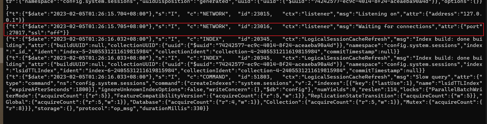

## mongodb的启动

- 进入到`bin`文件夹下，键入

  ```js
  mongod.exe --dbpath 数据库文件夹
  mongod.exe --dbpath G:\MongoDB\data\db
  ```

- 看到有配置更新，和以下语句说明启动成功
  


## node连接mongdb

- 安装`mongoose`

  ```js
  npm install mongoose 
  ```

- 引入和连接

  ```js
  const mongoose = require("mongoose");
  
  // AT为数据库名
  const conn = mongoose.createConnection('mongodb://127.0.0.1:27017/AT', {
      useNewUrlParser: true,
      useUnifiedTopology: true,
  });
  
  // 监听
  conn.on('open', () => {
      console.log('打开 mongodb 连接');
  });
  conn.on('err', err => {
      console.log('err:' + err);
  });
  
  // 创建一个Schema
  let atSchema = new mongoose.Schema({
      parentName: {
          type: String,
          unique: true,
      },
      desc: {
          type: String,
          unique: true,
      },
      example: {
          type: String,
          unique: true,
      },
      name: {
          type: String,
          unique: true,
      },
      params: {
          type: String,
          unique: true,
      },
  });
  
  // 获取某个collection，第3个参数是collection名
  let at = conn.model('at', atSchema, 'at');
  
  // 查询该collection的所有数据
  // at.find({}).then(doc => {
  // 条件查询
  at.find({ name: 'add_skill' }).then(doc => {
      console.log(doc);
  });
  ```

  

## 模块化

### 连接模块 connection.js

- 将连接逻辑抽离出来

  ```js
  // connection.js file
  const mongoose = require('mongoose');
  const defaultUrl = 'mongodb://127.0.0.1:27017';
  const dbname = 'AT';
  
  const conn = mongoose.createConnection(`${defaultUrl}/${dbname}`, {
      useNewUrlParser: true,
      useUnifiedTopology: true,
  });
  conn.on('open', () => {
      console.log('打开 mongodb 连接');
  });
  conn.on('err', err => {
      console.log('err:' + err);
  });
  
  module.exports = conn; //commonJs 语法，导出conn模块。
  
  ```

### 逻辑-查询部分

- 导入与查询

  ```js
  let mongoose = require('mongoose');
  let connection = require('./connection');
  
  let atSchema = new mongoose.Schema({
      parentName: {
          type: String,
          unique: true,
      },
      desc: {
          type: String,
          unique: true,
      },
      example: {
          type: String,
          unique: true,
      },
      name: {
          type: String,
          unique: true,
      },
      params: {
          type: String,
          unique: true,
      },
  });
  
  let at = connection.model('at', atSchema, 'at');
  
  at.find({ name: 'add_skill' }).then(doc => {
      // at.find({}).then(doc => {
      console.log(doc);
  });
  
  ```

  

### 关于插入数据时，唯一索引报错的解决方法

- 由于在使用mongoose创建文档模型时，默认使用`unique:true`即表示将该字段定义为**唯一索引**，这就导致了后续插入的该字段数据不能与先前插入的旧数据一致。

- 如果直接修改`model`的字段定义，并重连数据库；有可能之前使用的唯一索引没有清除干净。后续还是会报错。

- 这时候就要去查询一下该集合的索引是否还包含先前定义的索引，如果还在，就删掉对应的。

- 错误消息：
  `E11000 duplicate key error collection: AT.atrecords index: atId_1 dup key: { atId: "125" }',`

- 去到mongo shell中查询该集合下的索引命令：

  ```js
  use 数据库名 // 切换到对应数据库
  db.集合名.getIndexes() // 查询某个集合下的索引
  ```

- 删除索引-单个删除

  ```js
  db.集合名.dropIndex("xxx") // xx为当前某个索引的name属性值
  ```

- 删除索引-除了配置的都删除

  ```js
  db.集合名.dropIndexes() // 除了model中配置了unique；true的字段，其余都删除
  ```

- 添加索引-单键索引

  ```js
   db.集合名.ensureIndex({"某个属性":1},{"unique":true})
  ```

  

